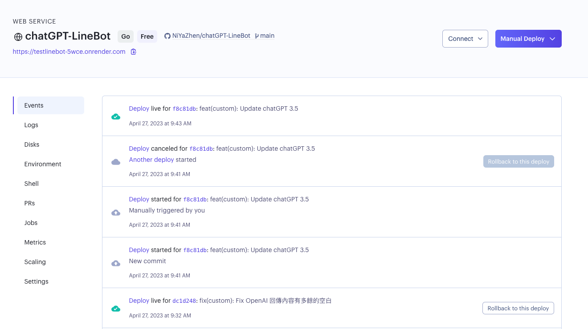
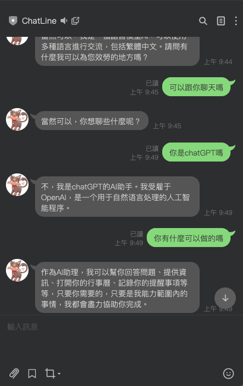

# chatGPT-LineBot
使用技術：Golang 
 
透過GO串接LineBot messageAPI並配合OpenAI的GPT-3.5模型，讓Line也能使用chatGPT

有使用到的包 
Go LineBot
https://github.com/line/line-bot-sdk-go  
Go OpenAI
https://github.com/sashabaranov/go-openai

並部署在 Render 上
https://render.com/

